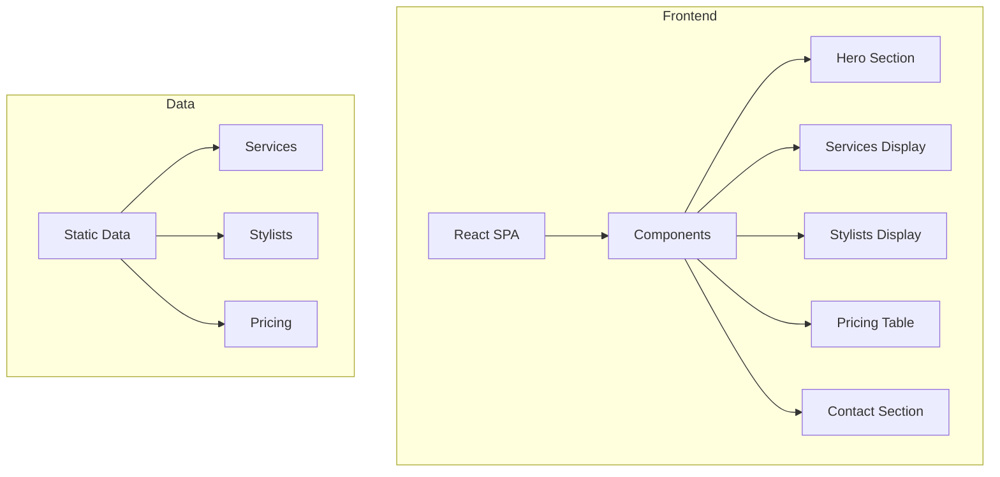

## 1. Architecture Design

## 2. Technology Description
- Frontend: React@18 + tailwindcss@3 + vite
- Initialization Tool: vite-init
- Backend: None (静态展示页面)
- Database: None (使用静态数据)

## 3. Route Definitions
| Route | Purpose |
|-------|---------|
| / | 首页展示 |

## 4. API Definitions (if backend exists)
本项目不涉及后端API

## 5. Server Architecture Diagram (if backend exists)
本项目不涉及后端服务

## 6. Data Model (if applicable)
本项目使用静态数据，无需数据库

### 6.1 Data Model Definition
无需数据模型

### 6.2 Data Definition Language
无需DDL语句
