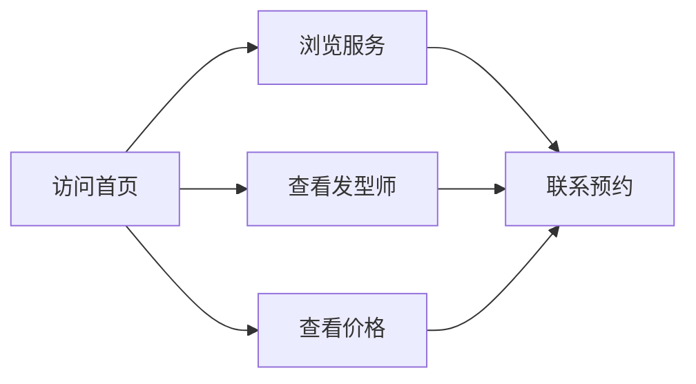

## 1. Product Overview
这是一个理发店微信小程序展示页面，用于展示理发店的服务、发型师、价格等信息。
- 主要目的是为理发店提供一个现代化的线上展示平台，让用户了解理发店的服务内容、查看发型师信息，提升理发店的品牌形象
- 目标用户是需要理发服务的顾客

## 2. Core Features

### 2.1 User Roles
| Role | Registration Method | Core Permissions |
|------|---------------------|------------------|
| 访客 | 无需注册 | 浏览理发店信息、查看服务、查看发型师、查看价目表 |

### 2.2 Feature Module
1. **首页**: 英雄区、导航、服务展示、发型师展示、价格展示
2. **服务详情页**: 详细服务说明、服务特点
3. **发型师详情页**: 发型师介绍、作品展示

### 2.3 Page Details
| Page Name | Module Name | Feature description |
|-----------|-------------|---------------------|
| 首页 | 英雄区 | 展示理发店品牌形象、标语、主要服务 |
| 首页 | 服务展示 | 展示理发店提供的主要服务项目，带图标和描述 |
| 首页 | 发型师展示 | 展示理发店的发型师团队，包含头像、姓名、职位、简介 |
| 首页 | 价格展示 | 展示理发店的服务价格表 |
| 首页 | 联系我们 | 展示理发店地址、电话、营业时间 |

## 3. Core Process
用户访问小程序 → 浏览首页了解理发店信息 → 查看服务项目 → 查看发型师信息 → 通过电话预约或到店消费

## 4. User Interface Design
### 4.1 Design Style
- 主色调：深蓝色 #1a365d（体现专业、高端
- 辅助色：金色 #d69e2e（点缀，体现品质
- 中性色：深灰、浅灰、白色
- 按钮风格：圆角矩形，渐变背景，hover效果
- 字体：Noto Sans SC，标题加粗，正文清晰易读
- 布局风格：卡片式设计，网格布局
- 图标风格：简洁现代的线性图标

### 4.2 Page Design Overview
| Page Name | Module Name | UI Elements |
|-----------|-------------|-------------|
| 首页 | 英雄区 | 全屏背景图，渐变叠加，品牌名称，简洁现代的动画效果 |
| 首页 | 服务展示 | 卡片式，每个服务带图标、标题、描述，hover放大效果 |
| 首页 | 发型师展示 | 圆形头像，卡片式，hover时显示更多信息 |
| 首页 | 价格展示 | 表格形式，清晰的价格列表 |
| 首页 | 联系我们 | 图标+文字组合，地图占位图 |

### 4.3 Responsiveness
移动优先设计，适配微信小程序尺寸，触摸优化

### 4.4 3D Scene Guidance
本项目不涉及3D场景
